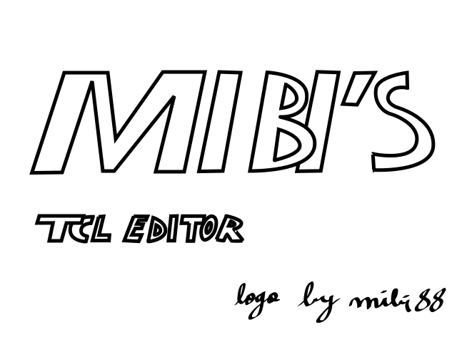
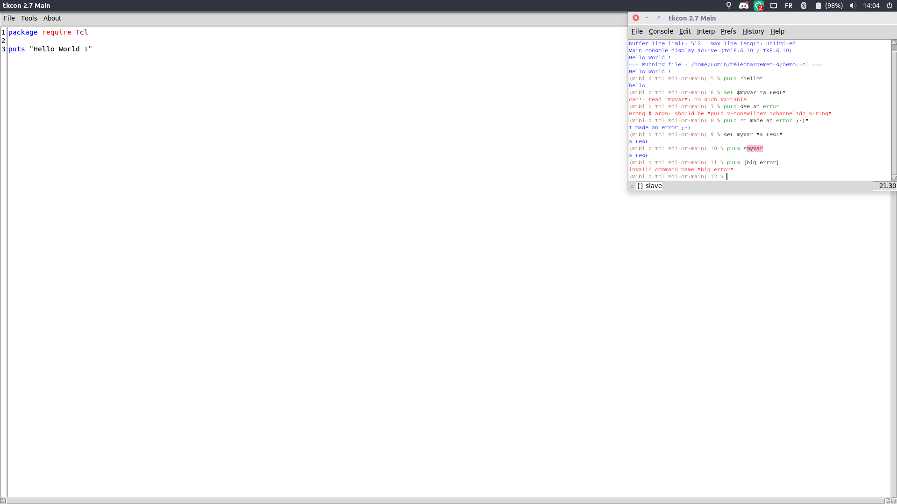
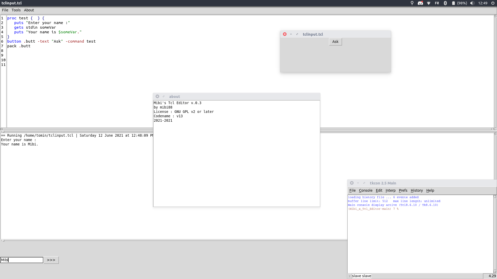
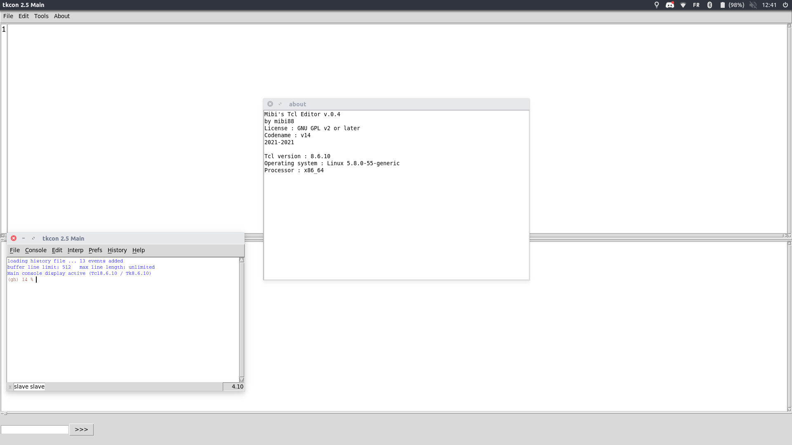

# Mibi's Tcl Editor
Mibi's Tcl Editor --- A small IDE to write Tcl code.

**Logo license : CC-BY-NC-SA 4.0**

---

**Mibi's Tcl Editor's 6 months : v11 public ➡️ v15**

---

## Require :
* `Tcl 8.6` at least (tested under Tcl 8.6.10)
* `Tk 8.6` at least (tested under Tk 8.6.10)
* `Ctext` megawidget (a part of `tklib`)
* `tkcon` (not as a library : see "Run")
## Screenshots
---

Screenshot of `v.0.1.6`

Screenshot of `v.0.3`

Screenshot of `v.0.4`

---
## Run
To run Mibi's Tcl Editor, perform these following tasks :
* Clone this repository
* If Tcl 8.6 and Tk 8 are not installed, install these softwares.
* Add a copy of Tkcon 2.5 (only the `tkcon.tcl` file) that you can get [here](https://sourceforge.net/projects/tkcon/)
* Check that `tklib`'s `ctext` is installed
* Run `index.tcl`

And you're ready !
