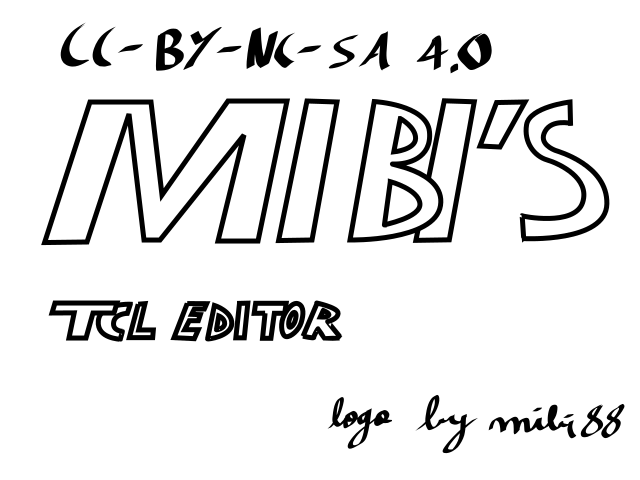
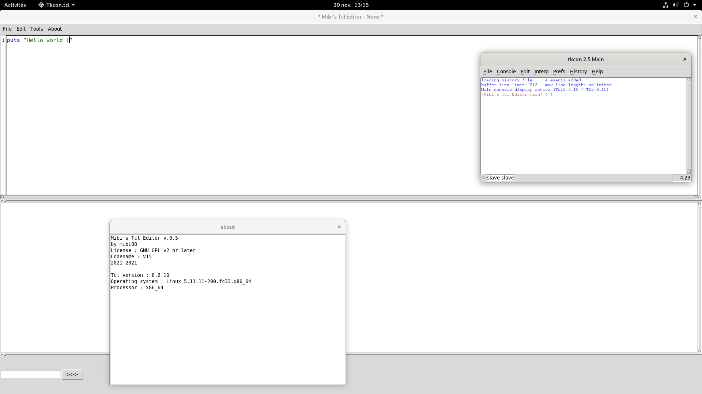
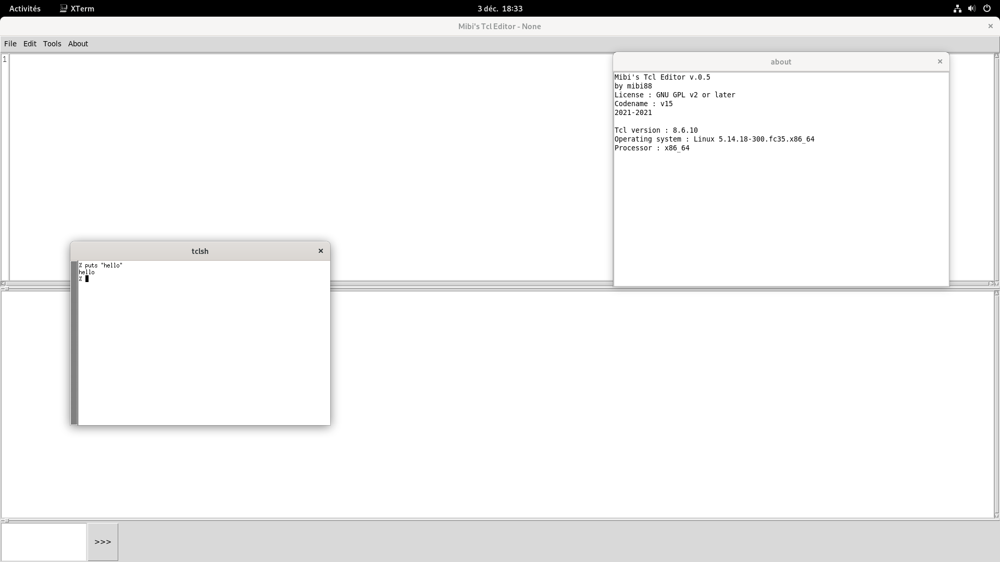

# Mibi's Tcl Editor
Mibi's Tcl Editor --- A small IDE to write Tcl code.

**Logo license : CC-BY-NC-SA 4.0**

---

**Mibi's Tcl Editor's 6 months : v11 public ➡️ v15**

---

## Requirements :
* `Tcl 8.6` at least (tested under Tcl 8.6.10)
* `Tk 8.6` at least (tested under Tk 8.6.10)
* `Ctext 3.2` megawidget (a part of `tklib`)
* `tkcon` (not as a library : see "Run")
## Screenshots
---

Screenshot of `v.0.1.6` on Ubuntu Unity 20.04.

Screenshot of `v.0.3` on Ubuntu Unity 20.04.

Screenshot of `v.0.4` on Ubuntu Unity 20.04.

Screenshot of `v.0.5b1` on Fedora 33.

Screenshot of `v.0.5` on Fedora 35.

---
## Run
To run Mibi's Tcl Editor, perform these following tasks :
* Clone this repository.
* If Tcl 8.6 and Tk 8 are not installed, install these softwares.
* Add a copy of Tkcon 2.5 (only the `tkcon.tcl` file) in at `./langs/tcl` that you can get [here](https://sourceforge.net/projects/tkcon/).
* Check that `tklib`'s `ctext` is installed.
* Run `index.tcl`.

And you're ready !

## Troubleshooting

* The "Refresh" Button is buggy. **The "Refresh" Button is not working everywhere, but the bug is due to Tcl.**
